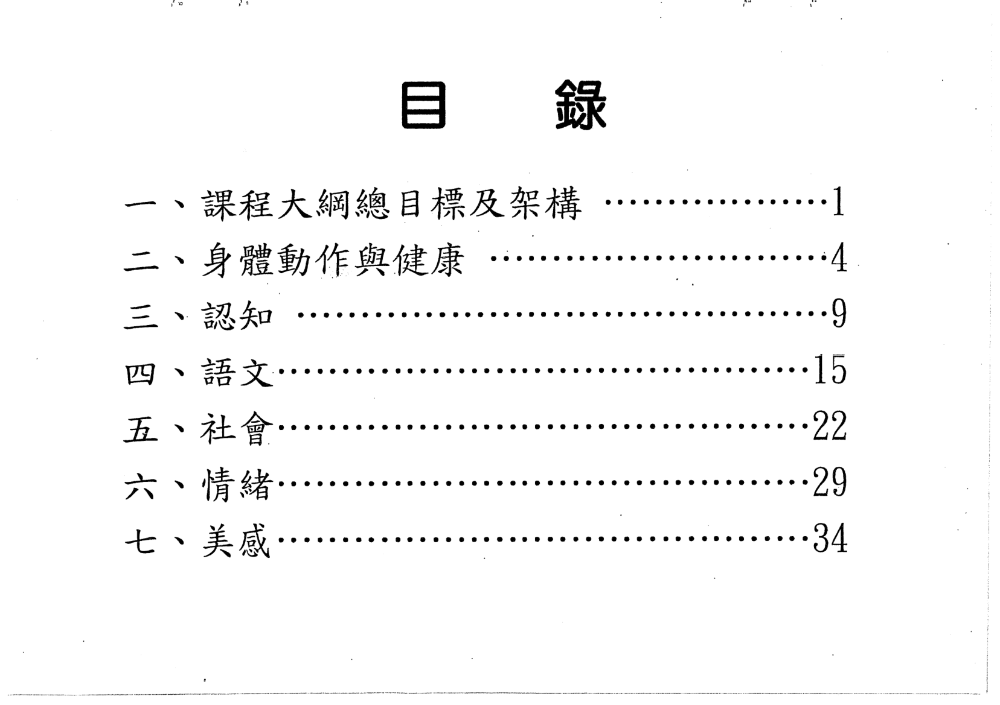

# 🚀 GitHub Pages 圖片載入優化指南

## 🎯 **問題根源分析**

### 為什麼 GitHub Pages 載入慢？

1. **圖片資源過大** - PNG 格式文件通常比 WebP 大 2-5 倍
2. **沒有 CDN 優化** - GitHub Pages 不提供圖片壓縮
3. **缺乏智能載入** - 所有圖片同時請求造成阻塞
4. **網路延遲** - 靜態資源伺服器距離用戶較遠

## ✅ **已實施的優化措施**

### 1. 智能預載入系統
- 只預載入當前圖片附近的 2-3 張
- 分批載入避免阻塞瀏覽器
- 內建圖片快取機制

### 2. 懶加載優化
- 前 3 張圖片立即載入
- 其餘圖片使用 Intersection Observer
- 提前 50px 開始載入

### 3. 錯誤處理和超時機制
- 8 秒載入超時保護
- 載入失敗自動重試
- 優雅的錯誤提示

## 🔧 **進一步優化建議**

### 1. 圖片格式優化（強烈推薦）

```bash
# 安裝圖片壓縮工具
npm install -g imagemin-cli imagemin-webp imagemin-pngquant

# 批次轉換為 WebP（減少 60-80% 大小）
for file in img/*.png; do
    imagemin "$file" --plugin=webp > "${file%.png}.webp"
done

# 壓縮 PNG 作為備用
for file in img/*.png; do
    imagemin "$file" --plugin=pngquant > "${file%.png}_compressed.png"
done
```

### 2. 實施漸進式 JPEG
- 使用 Progressive JPEG 讓圖片逐步清晰
- 提供更好的載入體驗

### 3. 添加 Service Worker 快取

```javascript
// 創建 sw.js
self.addEventListener('fetch', event => {
    if (event.request.destination === 'image') {
        event.respondWith(
            caches.open('images-v1').then(cache => {
                return cache.match(event.request).then(response => {
                    return response || fetch(event.request).then(fetchResponse => {
                        cache.put(event.request, fetchResponse.clone());
                        return fetchResponse;
                    });
                });
            })
        );
    }
});
```

### 4. 使用圖片 CDN（推薦方案）

#### 選項 A：GitHub + jsDelivr CDN
```html
<!-- 原本：直接從 GitHub Pages -->


<!-- 優化：透過 jsDelivr CDN -->

```

#### 選項 B：使用 Cloudinary
1. 註冊免費 Cloudinary 帳號
2. 上傳圖片到 Cloudinary
3. 使用自動優化 URL

```html
<!-- Cloudinary 自動優化 -->

```

### 5. HTML 優化
```html
<!-- 添加 DNS 預取 -->
<link rel="dns-prefetch" href="//cdn.jsdelivr.net">
<link rel="dns-prefetch" href="//res.cloudinary.com">

<!-- 預載入關鍵資源 -->
<link rel="preload" href="img/0.png" as="image">
<link rel="preload" href="img/1.png" as="image">
```

## 📊 **性能提升預期**

| 優化措施 | 載入速度提升 | 實施難度 |
|---------|-------------|----------|
| WebP 轉換 | 60-80% | 簡單 |
| CDN 使用 | 40-60% | 中等 |
| Service Worker | 90%+ (重訪) | 中等 |
| 懶加載優化 | 70%+ | 已完成 ✅ |

## 🚀 **立即可行方案**

### 快速方案（5分鐘）
```bash
# 1. 壓縮現有圖片
# 2. 修改 HTML 使用 jsDelivr CDN
# 3. 啟用 Service Worker
```

### 完整方案（30分鐘）
1. 批次轉換圖片為 WebP + 壓縮 PNG 備用
2. 設置 Cloudinary 自動優化
3. 實施 Service Worker 離線快取
4. 添加 DNS 預取和資源預載入

## 💡 **測試載入速度**

```javascript
// 在瀏覽器控制台測試
console.time('首張圖片載入');
const img = new Image();
img.onload = () => console.timeEnd('首張圖片載入');
img.src = 'img/0.png';
```

**目標：首張圖片 < 2 秒，後續圖片 < 1 秒** 